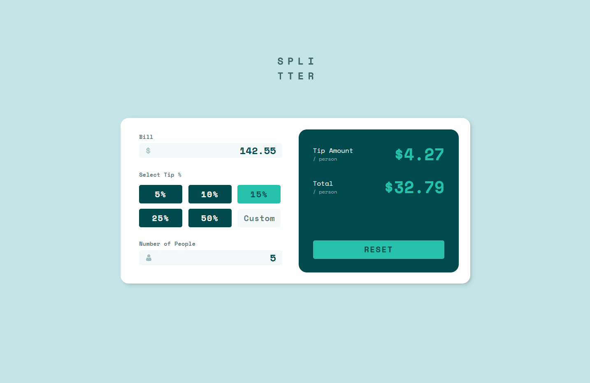
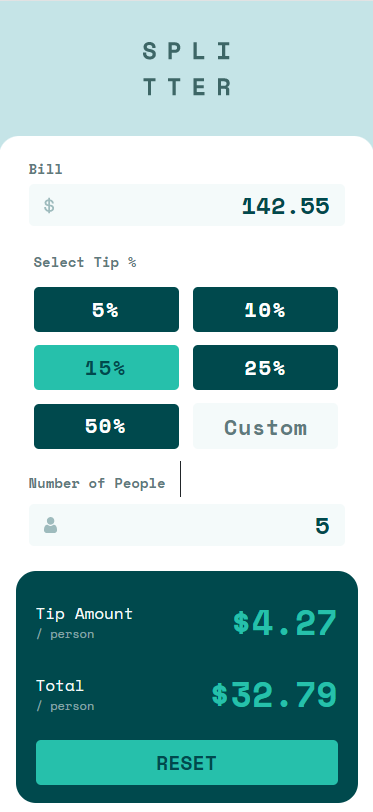

# Frontend Mentor - Tip calculator app solution

This is a solution to the [Tip calculator app challenge on Frontend Mentor](https://www.frontendmentor.io/challenges/tip-calculator-app-ugJNGbJUX). Frontend Mentor challenges help you improve your coding skills by building realistic projects.

## Table of contents

- [Overview](#overview)
  - [The challenge](#the-challenge)
  - [Screenshot](#screenshot)
  - [Links](#links)
- [My process](#my-process)
  - [Built with](#built-with)
  - [What I learned](#what-i-learned)
  - [Continued development](#continued-development)
  - [Useful resources](#useful-resources)
- [Author](#author)
- [Acknowledgments](#acknowledgments)

## Overview

### The challenge

Users should be able to:

- View the optimal layout for the app depending on their device's screen size
- See hover states for all interactive elements on the page
- Calculate the correct tip and total cost of the bill per person

### Screenshot




### Links

- Solution URL: [https://www.frontendmentor.io/solutions/tip-calculator-8B-V66AQB]
- Live Site URL: [https://tip-calculator-one-theta.vercel.app/]
- GitHub Repo: [https://github.com/JaJamaRu14/tip-calculator.git]

## My process

### Built with

- Semantic HTML5 markup
- CSS custom properties
- Flexbox
- SCSS
- Bootstrap
- Vanilla JS

### What I learned

Responsive styling is still one of my major weaknesses. Will work on Flexbox and CSS Grid more.
I will try to use BEM method to name my classes for the next project and also better scss structure.
JS needs a lot more practice...

```css
.reset {
  color: $very-dark-cyan;
  background: $primary-cyan;
  display: block;
  margin-top: 10rem;
  width: 100%;

  @include mq(xs) {
    margin-top: 2rem;
    font-size: 2rem;
    letter-spacing: 0;
  }

  @include mq(xxl) {
    background-color: rgba(255, 255, 255, 0.075);
    color: $very-dark-cyan;
  }

  // remove blur focus on reset button when clicked
  &:focus {
    outline: none;
    box-shadow: none;
  }

  // button click animation
  &:active {
    transform: translate(0, 1.5px);
  }
}
```

```js
// Calculate the results and display them
const calcResult = () => {
  if (billAmount && tipPercentage >= 0 && headCount) {
    let tipPerPerson = (billAmount * tipPercentage) / headCount;
    let billPerPerson = (billAmount + billAmount * tipPercentage) / headCount;
    // cent単位で切り捨て
    tipAmountDisplay.innerHTML = `$${Math.floor(tipPerPerson * 100) / 100}`;
    // cent単位で切り上げ
    totalAmountDisplay.innerHTML = `$${Math.ceil(billPerPerson * 100) / 100}`;

    resetBtn.classList.add('selected');
  }
};
```

### Continued development

I am going to learn more about scss and js libraries such as React.

### Useful resources

- [Math.round, .ceil, .floor](https://qiita.com/nagito25/items/0293bc317067d9e6c560) - JS で桁指定の仕方
- [visibility and display](https://www.sejuku.net/blog/54994)
- [before と after の使い方](https://saruwakakun.com/html-css/basic/before-after)

## Author

- codepen - [@JaJamaRu](https://codepen.io/JaJamaRu)
- Frontend Mentor - [@JaJamaRu14](https://www.frontendmentor.io/profile/JaJamaRu14)
- Twitter - [@shotime_14](https://twitter.com/shotime_14)
